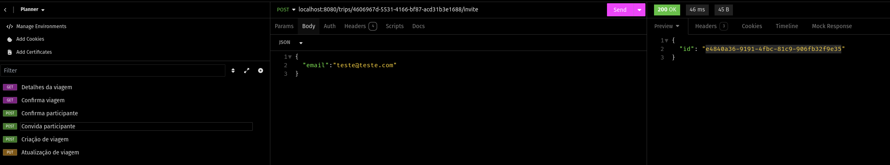
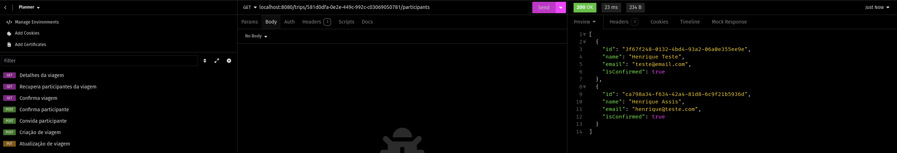
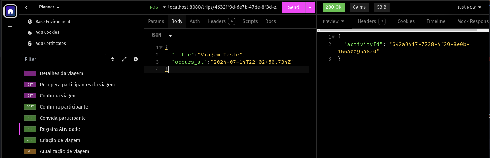
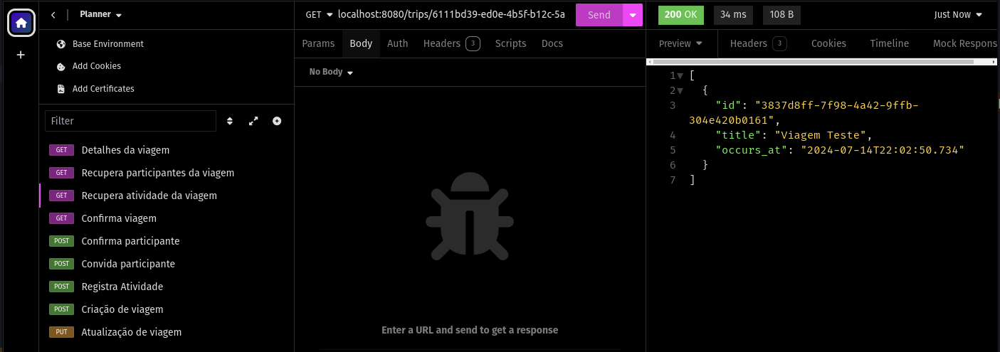
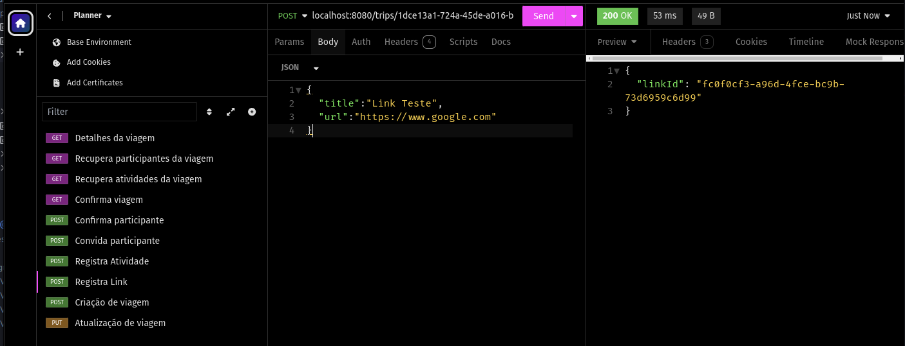
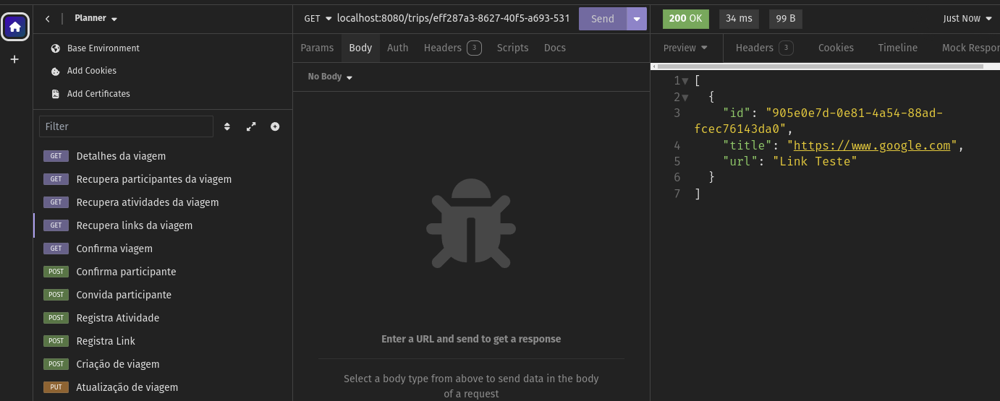

* ROTAS:
  * Criação de viagem
  

  * Detalhes da viagem
  
  
  * Atualização da viagem
  
  
  * Confirmação da viagem
  
  
  * Confirma participante
  
  
  * Convida participante
  

  * Recupera participantes da viagem
  

  * Registra Atividade
  
  
  * Recupera Atividades da Viagem
  
  
  * Criação de Link
  

  * Recupera Links da Viagem
  
